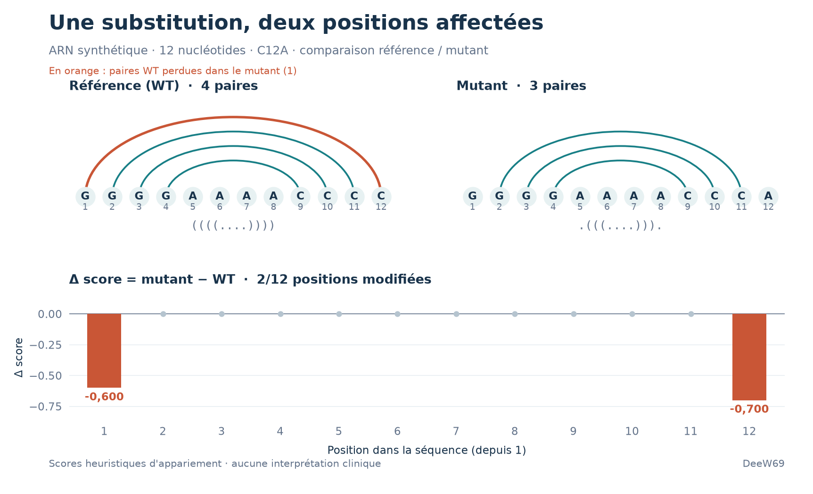

# DeepStructGenomics-NCBI

[](LICENSE)
[](pyproject.toml)
[](https://github.com/DeeW69/__DeepStructGenomics-NCBI/releases/tag/v0.2.0)
[](https://github.com/DeeW69/__DeepStructGenomics-NCBI/actions/workflows/tests.yml)

DeepStructGenomics-NCBI est un cadre de recherche et d'ingénierie logicielle dédié à l'étude structurale de l'ARN et de la régulation génomique à partir des données publiques du NCBI. L'objectif est de relier systématiquement séquences biologiques, structures (ARN et architecture 3D) et impact fonctionnel potentiel, afin de proposer des analyses mécanistiques exploitables en recherche biomédicale.

**Projet en développement actif — README mis à jour le 6 octobre 2026.**
La dernière version publiée est **v0.2.0**. Les notes et les exemples téléchargeables
sont regroupés dans la [release v0.2.0](https://github.com/DeeW69/__DeepStructGenomics-NCBI/releases/tag/v0.2.0).
La stabilisation **v0.2.x** a commencé sur `main` avec le verrouillage des dépendances.
La validation locale du 6 octobre 2026 compte **95 tests réussis** sous
Windows / Python 3.11, ainsi qu'une vérification du paquet installé.
Le [workflow de tests](.github/workflows/tests.yml) est configuré pour
Linux / Python 3.10 et Windows / Python 3.12 ; le badge ci-dessus suit les
exécutions sur GitHub.

[Features par version](#features-par-version) · [Démo](#démo-hors-ligne) ·
[Installation](#installation-rapide) · [FASTA](#charger-des-fichiers-fasta) ·
[Roadmap](#roadmap) · [Contribuer](#suivi-et-contributions)

## Features par version

### v0.2.x — en développement, non publiée

- Versions des dépendances du pipeline et des tests fixées dans
  [`requirements-lock.txt`](requirements-lock.txt), avec vérification SHA-256.
- Même verrou utilisé en local et dans le workflow Linux/Windows, avec contrôle
  de compatibilité via `pip check`.
- [Guide des dépendances](docs/dependencies.md) pour installer cet environnement
  et régénérer le verrou lors des prochaines mises à jour.

Ces changements sont disponibles sur `main` ; ils ne font pas partie des
archives de la release v0.2.0.

### v0.2.0 — publiée le 6 octobre 2026

Cette version améliore la comparaison référence/mutant et la prise en main du
pipeline. Les fonctionnalités ci-dessous sont présentes dans le code :

| Fonctionnalité | Ce que permet la v0.2.0 |
| --- | --- |
| Entrées FASTA | Charger une référence et un mutant avec `--fasta` et `--mutant-fasta`, une séquence par fichier. |
| Validation des séquences | Convertir ADN → ARN (`T` → `U`) pour toutes les sources et signaler les caractères invalides avec leur position. |
| Rapports enrichis | Lire les statistiques des deltas et jusqu'à dix positions les plus modifiées dans le rapport Markdown. |
| Résumé réutilisable | Retrouver le même `impact_summary` dans l'API Python, le rapport JSON et les artefacts de visualisation. |
| Comparaison visuelle | Inspecter les overlays WT/mutant, les deltas, les liens positionnels et les connecteurs d'appariements. |
| Export PNG | Choisir une caméra, un fond, une résolution et exporter sans fenêtre interactive. |
| Démo reproductible | Essayer deux ARN synthétiques hors ligne, avec exemples FASTA, résultats attendus et figure régénérable. |
| Maintenance | Tests de validation et d'intégration hors réseau, workflow Linux/Windows et vérification du paquet installable. |

**Compatibilité :** les caractères non pris en charge sont désormais refusés
au lieu d'être supprimés silencieusement. Les positions affichées dans le
Markdown et les hotspots commencent à 1 ; les champs JSON historiques
`structure.base_pairs` et `variant_analysis.substitutions[].position` restent
comptés depuis 0.

### v0.1.0 — socle initial

Le socle comprend la récupération NCBI ou la saisie directe d'une séquence,
une prédiction secondaire ARN simplifiée de type Nussinov, la comparaison
référence/mutant, les rapports JSON/Markdown et les projections pseudo-3D.

Le [changelog](CHANGELOG.md) détaille les évolutions et les corrections.

## Démo hors ligne

Après l'[installation](#installation-rapide), essayer la démo synthétique depuis
la racine du dépôt, sous Windows, macOS ou Linux :

```bash
python scripts/run_demo.py
```

Cette commande compare deux ARN de 12 nucléotides sans connexion réseau ni
interface graphique. Une substitution C12A supprime une paire prédite et fait
ressortir les positions 12 et 1 dans `outputs_demo/offline_demo.md`.
Les résultats sont reproductibles, hors horodatages.



Les scores sont heuristiques et ne constituent pas une interprétation clinique.
Voir le [guide de la démo](docs/demo.md) pour les séquences, les résultats attendus
et l'option `--output-dir`.

## Objectifs scientifiques

- **Pipeline séquence → structure → impact** : ingestion de séquences ou d'identifiants NCBI, annotation, modélisation structurale (surtout ARN) puis génération d'indicateurs fonctionnels.
- **Interprétation des variants** : comparaison de séquences référence/mutant pour estimer les effets structuraux ou régulateurs.
- **Génomique 3D** (à venir) : synthèse de données de contacts (Hi-C et apparentées) pour relier organisation spatiale du génome et régulation.

## Architecture de dépôt

```
DeepStructGenomics-NCBI/
|-- README.md
|-- requirements.txt
|-- requirements-lock.txt
|-- pyproject.toml
|-- CHANGELOG.md
|-- .github/workflows/tests.yml
|-- docs/
|   |-- demo.md
|   |-- dependencies.md
|   |-- visualization_3d.md
|-- data/
|   |-- examples/
|-- deepstructgenomics/
|   |-- __init__.py
|   |-- config.py
|   |-- pipeline.py
|   |-- analysis/
|   |   |-- impact_summary.py
|   |-- data_sources/
|   |   |-- __init__.py
|   |   |-- ncbi_client.py
|   |-- rna/
|   |   |-- __init__.py
|   |   |-- secondary_structure.py
|   |-- variants/
|   |   |-- __init__.py
|   |   |-- variant_analysis.py
|   |-- reporting/
|   |   |-- __init__.py
|   |   |-- report_generator.py
|   |-- visualization/
|       |-- __init__.py
|       |-- io_structures.py
|       |-- score_mapping.py
|       |-- tk_vtk_minimal.py
|       |-- tk_vtk_molecule.py
|       |-- tk_vtk_overlay.py
|-- scripts/
|   |-- run_demo.py
|   |-- plot_demo.py
|   |-- run_pipeline.py
|   |-- view_3d.py
|-- tests/
```

- `data_sources` couvre l'interfaçage NCBI (séquences, annotations, variants).
- `rna` contient les modèles de structures secondaires et l'extraction de motifs.
- `variants` fournit les comparaisons référence/mutant (impact structural).
- `analysis` calcule les statistiques de variation et les positions les plus modifiées.
- `reporting` regroupe la génération de sorties JSON et Markdown.
- `visualization` implémente la lecture des structures, la conversion de scores et les viewers VTK standalone.
- `scripts/run_pipeline.py` expose la CLI principale, `scripts/view_3d.py` lance les viewers 3D.

## Pipeline actuel

Entrées possibles :

1. Identifiant NCBI (nucléotidique, par ex. `NR_000027.1`).
2. Séquence ARN ou ADN fournie directement, accompagnée d'un nom ou d'un identifiant libre.
3. Fichier FASTA local contenant une seule séquence ARN ou ADN.

Sorties :

- Fichier JSON structuré incluant métadonnées, annotations simples, score de stabilité, paires de bases prédites.
- Rapport Markdown synthétisant les mêmes informations et intégrant une représentation ASCII de la structure secondaire.
- Résumé des écarts référence/mutant avec statistiques et positions les plus modifiées (positions comptées depuis 1), inclus dans les rapports.
- Dossier `visualization/` avec structures pseudo-3D (WT et, si fourni, mutant), scores normalisés et manifeste. Son export n'ouvre pas le viewer.

### Étapes principales

1. **Récupération / normalisation** : téléchargement via E-utilities (NCBI), lecture FASTA ou validation de la séquence fournie ; conversion ADN → ARN.
2. **Annotation simple** : calcul longueur, composition, GC%, heuristiques de fonctionnalités.
3. **Prédiction de structure secondaire** : implémentation interne d'un algorithme type Nussinov avec matrice énergie simplifiée.
4. **Analyse variant (optionnelle)** : si une séquence mutante est fournie, comparaison des structures prédites et estimation heuristique de l'impact.
5. **Reporting et visualisation** : sérialisation JSON/Markdown + génération de structures pseudo-3D et scores dérivés.

## Format de sortie

```text
outputs/
  NR_000027.1.json
  NR_000027.1.md
  NR_000027.1/
    visualization/
      wt_structure.pdb
      mutant_structure.pdb       # si variant fourni
      mutant_scores.json         # scores [0..1] par résidu / position
      wt_scores.json
      impact_summary.json        # même résumé que dans le rapport JSON
      visualization_manifest.json
```

Les structures 3D générées sont des projections contraintes (une sphère par nucléotide) destinées à comparer des états WT/mutant. Elles ne représentent pas une conformation atomique unique. Les scores sont dérivés des appariements (structure secondaire) et servent à visualiser des gradients relatifs.

## Installation rapide

Depuis la branche `main`, avec Python 3.10 ou ultérieur. Le verrou est validé
sous Linux / Python 3.10 et Windows / Python 3.12. Sous macOS / Linux :

```bash
python -m venv .venv
source .venv/bin/activate
python -m pip install --require-hashes --only-binary=:all: -r requirements-lock.txt
```

Sous Windows PowerShell, l'activation est facultative :

```powershell
python -m venv .venv
.\.venv\Scripts\python.exe -m pip install --require-hashes --only-binary=:all: -r requirements-lock.txt
.\.venv\Scripts\python.exe scripts/run_demo.py
```

L'installation initiale télécharge les dépendances. La démo fonctionne ensuite
hors ligne et ne lance pas le viewer VTK.

Les versions et empreintes sont partagées avec la CI. Le
[guide des dépendances](docs/dependencies.md) détaille leur mise à jour et les
limites selon la plateforme. Depuis le tag `v0.2.0`, qui précède ce verrou,
utiliser `python -m pip install -r requirements.txt`.

## Utilisation du pipeline

```bash
python scripts/run_pipeline.py --accession NR_000027.1 --output-dir outputs
# ou
python scripts/run_pipeline.py --sequence AUGGCUACG --label test_seq --output-dir outputs
```

Les rapports `.json` et `.md` sont écrits dans le dossier de sortie, tandis que les artefacts de visualisation sont placés dans `outputs/<identifiant>/visualization/`.

### Charger des fichiers FASTA

Depuis la racine du dépôt, cette commande fonctionne sous Windows, macOS et
Linux après installation des dépendances :

```bash
python scripts/run_pipeline.py --fasta data/examples/reference.fasta --mutant-fasta data/examples/mutant.fasta --output-dir outputs_fasta
```

Les deux fichiers contiennent les mêmes ARN synthétiques de 12 nucléotides que
la démo : `GGGGAAAACCCC` et `GGGGAAAACCCA`. Le rapport est écrit dans
`outputs_fasta/fasta_demo.md`, avec la substitution C12A et les positions 12 et 1
en tête des variations de score. L'exécution est entièrement hors ligne.

Chaque fichier doit contenir **une seule séquence**, précédée d'un en-tête
commençant par `>`. Les séquences peuvent être réparties sur plusieurs lignes.
Le premier mot de l'en-tête fournit l'identifiant ; `--label` permet de choisir
un autre nom pour les sorties. La description et la provenance FASTA sont
conservées dans le rapport JSON.

Les caractères incompatibles avec un nom de fichier, notamment les séparateurs de dossier et `:`,
sont remplacés par `_` dans les noms de sortie. Les noms réservés sous Windows
sont préfixés par `_`. L'identifiant original reste conservé dans les rapports.

Pour les chemins contenant des espaces, utiliser des guillemets :

```bash
python scripts/run_pipeline.py --fasta "mes sequences/reference.fa" --mutant-fasta "mes sequences/mutant.fa" --label comparaison --output-dir "outputs/ma comparaison"
```

Les sources de référence `--accession`, `--sequence` et `--fasta` sont
mutuellement exclusives. Pour la comparaison facultative, choisir
`--mutant-sequence` ou `--mutant-fasta`. Il est possible de mélanger les formats,
par exemple une référence NCBI et un mutant dans un fichier FASTA.

### Validation des séquences

Les mêmes règles s'appliquent à la référence et au mutant, qu'ils proviennent
du NCBI, d'une chaîne fournie directement ou d'un fichier FASTA :

- Les minuscules sont converties en majuscules ; les espaces (y compris les
  espaces insécables), tabulations et retours à la ligne sont ignorés.
- Les bases `A`, `C`, `G`, `T` et `U` sont acceptées. `T` est converti en `U`
  avant les calculs et la comparaison : les versions ADN et ARN d'une même
  séquence ne créent donc pas de substitutions artificielles.
- Les codes ambigus (`N`, `R`, etc.), les gaps (`-`), les chiffres et les autres
  caractères sont refusés, avec indication de leur position dans la séquence
  sans espaces, comptée depuis 1. Ainsi, `AUGNC` signale `N` à la position 4.
- Une séquence vide, un FASTA sans en-tête ou contenant plusieurs séquences
  produit une erreur explicite.

**Changement de compatibilité :** des entrées auparavant raccourcies
silencieusement par suppression de caractères invalides sont désormais
refusées. Corriger la séquence source avant de relancer l'analyse afin de
conserver une correspondance fiable entre positions et résultats.

## Visualisation 3D contrainte

Le viewer desktop est accessible via :

```bash
python scripts/view_3d.py --mode minimal
python scripts/view_3d.py --mode molecule --structure path/to/model.pdb
python scripts/view_3d.py --mode overlay --wt path/to/wt.pdb --mut path/to/mut.pdb --scores path/to/mutant_scores.json
```

Consultez le [guide de visualisation](docs/visualization_3d.md) pour les détails d'installation, les formats attendus (`mutant_scores.json`, `visualization_manifest.json`) et les limites scientifiques. Les structures secondaires sont prédites par une heuristique ; les projections 3D ne sont pas des conformations atomiques validées.

## Roadmap

Les versions ci-dessous indiquent les priorités de développement. Les tâches
non cochées restent à réaliser ; leur périmètre pourra évoluer selon les
retours, sans calendrier de livraison annoncé.

### v0.2.0 — consolidation terminée

- [x] Accepter les fichiers FASTA et uniformiser la validation ADN/ARN.
- [x] Intégrer les variations par position aux rapports Markdown et JSON.
- [x] Fournir une démo hors ligne avec une illustration reproductible.
- [x] Corriger les exports PDB et la compatibilité des annotations VTK.
- [x] Ajouter les tests d'intégration et le workflow Linux/Windows.
- [x] Publier la release v0.2.0 avec son tag, ses notes et les exemples de sortie.

### v0.2.x — stabilisation en cours

- [x] Verrouiller les versions des dépendances pour reproduire l'environnement de validation.
- [ ] Compléter la couverture du client NCBI : réponses vides, erreurs HTTP et délais dépassés.
- [ ] Documenter la correspondance des indices entre séquences, rapports et fichiers de visualisation.

### v0.3.0 — ergonomie prévue

- [ ] Ouvrir un résultat 3D avec `--manifest`, en résolvant automatiquement les chemins des structures et scores.
- [ ] Exporter les positions les plus modifiées en CSV pour les tableurs et notebooks.
- [ ] Exposer les seuils et le nombre de positions à afficher dans la CLI.

### Pistes à évaluer ensuite

- Cache local des séquences NCBI avec provenance et option de rafraîchissement.
- Traitement de plusieurs séquences FASTA par lot, avec un rapport par entrée.
- Évaluation des prédictions ARN sur des jeux de référence et comparaison à d'autres méthodes.
- Intégration exploratoire de données de contacts Hi-C pour la génomique 3D.

## Suivi et contributions

Les changements sont consignés dans le [changelog](CHANGELOG.md).
Les [issues GitHub](https://github.com/DeeW69/__DeepStructGenomics-NCBI/issues)
servent à signaler un problème ou proposer une évolution de la roadmap.
Pour un bug, joindre la commande, la version de Python et un exemple minimal
reproductible, sans clé API ni donnée sensible.

Après installation des dépendances, lancer les tests depuis la racine du dépôt :

```bash
python -m pytest
```

Sous Windows sans activation de l'environnement :

```powershell
.\.venv\Scripts\python.exe -m pytest
```

Le [guide des dépendances](docs/dependencies.md), le [guide de démo](docs/demo.md), le
[guide du viewer](docs/visualization_3d.md) et la
[checklist de release](docs/release_checklist.md) complètent ce README.

## Principes directeurs

- **Reproductibilité** : exemples fixes, paramètres documentés, dépendances verrouillées avec empreintes et tests automatisés.
- **Traçabilité** : chaque étape du pipeline enregistre ses paramètres et résultats intermédiaires (incluant les artefacts de visualisation).
- **Modularité** : les modules peuvent évoluer indépendamment pour intégrer de nouvelles méthodes (predictors ARN, intégration Hi-C).
- **Explicabilité** : prioriser des modèles interprétables, exposer les hypothèses biologiques et les incertitudes des prédictions.
- **Open science** : privilégier données publiques, formats ouverts et documentation accessible.

## Auteur

[DeeW69](https://github.com/DeeW69) · Licence MIT.
