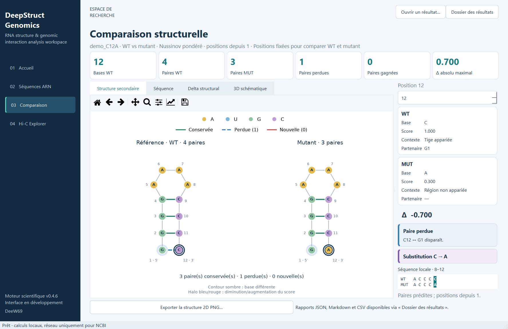
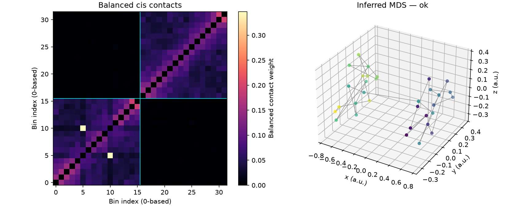

# DeepStructGenomics-NCBI

[](LICENSE)
[](pyproject.toml)
[](https://github.com/DeeW69/__DeepStructGenomics-NCBI/releases/tag/v0.4.6)
[](https://github.com/DeeW69/__DeepStructGenomics-NCBI/actions/workflows/tests.yml)

Outils de recherche pour analyser des séquences ARN, comparer leurs structures
secondaires et explorer des contacts génomiques Hi-C. Les séquences proviennent
du NCBI, de fichiers FASTA ou d'une saisie directe.

**Version actuelle : [v0.4.6](docs/releases/v0.4.6.md)** — 7 octobre 2026.
Cette release ajoute le benchmark ARN expérimental de v0.4.5 et l'analyse Hi-C
avancée de v0.4.6. Les résultats restent des analyses de recherche, sans usage clinique.

[Installation](#installation) · [Démarrage](#démarrage-hors-ligne) ·
[Benchmark ARN](#benchmark-arn) · [Hi-C](#analyse-hi-c) ·
[Documentation](#documentation-et-contributions) · [Versions](#série-v04x)

## Interface desktop — préparation v0.5.0

Disponible sur `main`, **pas encore publiée en release** : une interface PySide6
regroupe **Accueil → Séquences → Comparaison → Hi-C** autour du moteur existant.

```bash
python -m pip install --require-hashes --only-binary=:all: -r requirements-gui-lock.txt
python scripts/run_gui.py
```

Installer d'abord le socle décrit ci-dessous ; ajouter le verrou `research` pour
l'analyse Hi-C avancée. Depuis l'accueil, **Essayer la démo C12A** lance une
comparaison complète hors ligne. Les calculs sont annulables et ne bloquent pas
la navigation. Les résultats sont enregistrés dans `outputs_gui`.

- Recherche NCBI par gène/mots-clés, filtre organisme, résultats paginés et aperçu avant sélection WT.
- Référence par accession exacte, FASTA ou saisie directe ; mutant facultatif.
- Vue principale ARN 2D : tiges, boucles, bases A/U/G/C et comparaison WT/MUT.
- Séquence et contextes structuraux, deltas, sélection synchronisée et 3D schématique à la demande.
- Inspecteur WT/MUT : base, score, partenaire, contexte, badges de paires et séquence locale surlignée.
- Hi-C : contacts équilibrés, boucles candidates et reconstruction inférée.
- Historique local, réouverture des résultats, figures PNG et accès aux rapports.
- Accueil avec raccourcis d'import et métriques de la dernière analyse ARN consultée.
- États vides guidés, calcul annulable, succès et erreurs avec actions de correction.



La vue ARN 3D reste **schématique** ; aucune conformation moléculaire ni énergie
MFE n'est déduite de son affichage. [Guide desktop](docs/desktop.md).

## Installation

Python 3.10 ou ultérieur, depuis le tag `v0.4.6` ou la branche `main`.

```bash
python -m venv .venv
# Linux / macOS
source .venv/bin/activate
# Windows PowerShell : .\.venv\Scripts\Activate.ps1
python -m pip install --require-hashes --only-binary=:all: -r requirements-lock.txt
```

Sous Windows, l'activation est facultative : remplacer `python` par
`.\.venv\Scripts\python.exe` dans les commandes suivantes.

Pour exécuter ViennaRNA et les statistiques Hi-C avancées :

```bash
python -m pip install --require-hashes --only-binary=:all: -r requirements-research-lock.txt
python -m pip check
```

Ces extensions sont facultatives. Le wheel propose aussi l'extra `research`,
mais son installation seule n'applique pas les verrous. Voir le
[guide des dépendances](docs/dependencies.md).

## Démarrage hors ligne

```bash
python scripts/run_demo.py
# Une référence et un mutant
python scripts/run_pipeline.py --fasta data/examples/reference.fasta --mutant-fasta data/examples/mutant.fasta --output-dir outputs_fasta
# Plusieurs entrées, dans un nouveau dossier
python scripts/run_pipeline.py --batch-fasta data/examples/batch.fasta --output-dir outputs_batch
# Comparaison graphique des appariements
python scripts/view_secondary.py --manifest outputs_demo/offline_demo/visualization/visualization_manifest.json
```

La démo compare deux ARN synthétiques de 12 bases dans `outputs_demo` : la substitution
C12A supprime une paire prédite. Chaque analyse produit des rapports JSON/Markdown/CSV
et des artefacts de visualisation. Les lots isolent les erreurs par entrée et fournissent
`batch_summary.json`. Les séquences sont validées et converties de T vers U.

Pour une accession NCBI, avec accès réseau :

```bash
python scripts/run_pipeline.py --accession NR_000027.1 --output-dir outputs_ncbi
```

Le cache conserve provenance et empreinte SHA-256. `--refresh-cache` force son
renouvellement ; `--cache-dir` choisit son emplacement. Sources, seuils, erreurs
et formats sont décrits dans le [guide du pipeline](docs/pipeline.md).

## Benchmark ARN

```bash
python scripts/evaluate_rna.py --reference data/benchmarks/bprna_pdb.json --viennarna --output outputs_benchmark/metrics.json
```

Le corpus contient **30 références dérivées de structures expérimentales PDB**,
issues de bpRNA-1m et sélectionnées avant les prédictions. ViennaRNA 2.7.2 est
réellement exécuté ; versions, paramètres, structures et métriques sont conservés.

| Méthode | Précision micro | Rappel micro | F1 micro |
| --- | ---: | ---: | ---: |
| Nussinov pondéré du projet | 0,6123 | 0,6302 | 0,6211 |
| Glouton | 0,4708 | 0,4112 | 0,4390 |
| ViennaRNA MFE 2.7.2 | 0,8630 | 0,8127 | 0,8371 |

Ce petit échantillon sans pseudonœuds, non équilibré par famille, ne démontre pas
une performance générale. Voir la [provenance du corpus](data/benchmarks/README.md),
les [notes du benchmark](docs/releases/v0.4.5.md) et les
[résultats détaillés](docs/benchmarks/v0.4.5_rna.json).

## Analyse Hi-C

Synthèse descriptive, sans extension de recherche :

```bash
python scripts/explore_hic.py --contacts data/examples/hic_contacts.tsv --assembly synthetic --bin-size 10000 --output-dir outputs_hic
```

Analyse avancée d'une région cis :

```bash
python scripts/explore_hic.py --contacts data/examples/hic_region.tsv --assembly synthetic --bin-size 10000 --advanced --chromosome chrSynthetic --start 0 --end 320000 --missing-as-zero --output-dir outputs_hic_advanced
```

- Équilibrage à visibilité égale avec diagnostic de convergence.
- Tests de boucles par modèle de comptage et de frontières par permutations,
  avec correction des tests multiples.
- Domaines candidats, coordonnées 3D inférées par MDS et figure PNG.



Le mode avancé exige des comptes bruts, une région explicite de **400 bins maximum**
et un nouveau dossier de sortie. `--missing-as-zero` déclare que les contacts absents
sont des zéros observés : ne pas fournir uniquement des contacts présélectionnés.
Les q-values dépendent des modèles nuls et la 3D utilise des unités arbitraires.
L'exemple est synthétique ; il ne valide pas les méthodes sur des données biologiques.
Voir [les méthodes, paramètres et limites](docs/hic_analysis.md).

Les coordonnées Hi-C dépendent des contacts. Elles sont distinctes des PDB
illustratifs du pipeline ARN, dont la géométrie dépend seulement de la longueur.

## Série v0.4.x

| Incrément | Fonctionnalité livrée |
| --- | --- |
| v0.4.1 | Cache NCBI, provenance et rafraîchissement. |
| v0.4.2 | FASTA par lots et rapports par entrée. |
| v0.4.3 | Évaluation ARN sur références fournies et méthodes témoins. |
| v0.4.4 | Import et synthèse descriptive Hi-C ; première release globale. |
| v0.4.5 | Benchmark bpRNA/PDB et exécution de ViennaRNA. |
| v0.4.6 | Équilibrage Hi-C, tests statistiques, reconstruction 3D et documentation clarifiée. |

Les releases globales sont **v0.4.4** et **v0.4.6** ; les incréments intermédiaires
correspondent à des commits dédiés. Historique : [CHANGELOG.md](CHANGELOG.md).
Règles : [VERSIONING.md](VERSIONING.md).

Les prochaines validations concernent des corpus ARN plus larges et non redondants,
des données Hi-C expérimentales avec réplicats, la calibration des q-values et
la comparaison des reconstructions à des mesures indépendantes.

### Roadmap de l'application

- [x] Première interface desktop à quatre pages, calculs isolés et historique.
- [x] Import ARN NCBI/FASTA/saisie, comparaison et Hi-C reliés au moteur existant.
- [x] Rendu secondaire ARN avec tiges/boucles, différences de paires et inspection des bases.
- [ ] v0.5.0 : stabiliser l'interface sur les postes cibles et publier la première GUI.
- [x] Recherche NCBI avec aperçu, sélection WT et tableau de bord des résultats.
- [x] États visuels communs et inspecteur ARN enrichi, sans changement du moteur scientifique.
- [ ] Recette utilisateur v0.5.0 : parcours complets sur les postes cibles, sans aide du README.
- [ ] v0.5.x : lots FASTA, filtres NCBI avancés et paramètres scientifiques dans l'interface.
- [ ] v0.5.x : sélection croisée Hi-C, gestion de projets et comparaison de plusieurs analyses.
- [ ] v0.6.0 : distribution desktop simplifiée après validation des parcours et du packaging.

## Documentation et contributions

| Guide | Sujet |
| --- | --- |
| [Pipeline](docs/pipeline.md) | Sources, cache, lots, rapports et visualisation. |
| [Desktop](docs/desktop.md) | Interface PySide6, parcours, exports et limites. |
| [Démo](docs/demo.md) | Exemple ARN reproductible et résultats attendus. |
| [Coordonnées](docs/coordinates.md) | Conventions depuis 0 ou 1. |
| [Viewers](docs/visualization_3d.md) | Modes 3D, manifests et export PNG. |
| [Analyse Hi-C](docs/hic_analysis.md) | Méthodes, statistiques, reconstruction et limites. |
| [Dépendances](docs/dependencies.md) | Installation et régénération des verrous. |
| [Publication](docs/release_checklist.md) | Tests, paquets, tags et releases. |

```bash
python -m pytest
```

La CI teste Linux / Python 3.10 et Windows / Python 3.12, d'abord le socle puis
les extensions de recherche. Les tests utilisent les données locales fournies,
sans accès NCBI ni téléchargement de corpus.

Signaler un problème dans les [issues](https://github.com/DeeW69/__DeepStructGenomics-NCBI/issues)
avec la version, la commande et un exemple minimal, sans clé API ni donnée sensible.

Mainteneur : [DeeW69](https://github.com/DeeW69). Logiciel sous [licence MIT](LICENSE) ;
les références scientifiques conservent l'attribution à leurs producteurs.
