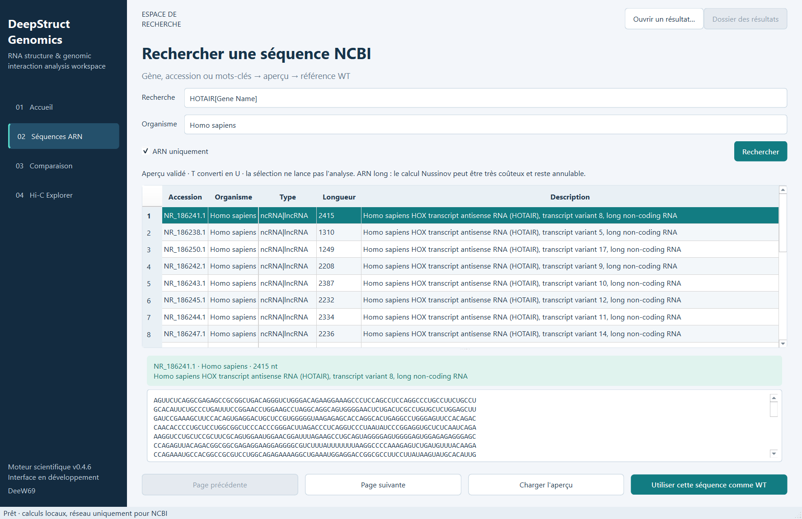

# Espace d'analyse desktop

Cette première interface prépare **v0.5.0** sur `main`. La dernière release
reste v0.4.6. Elle utilise PySide6/Qt et appelle les fonctions scientifiques
existantes ; les viewers et commandes CLI restent disponibles.

## Installation et lancement

Depuis un checkout avec Python 3.10 ou ultérieur :

```bash
python -m pip install --require-hashes --only-binary=:all: -r requirements-lock.txt -r requirements-gui-lock.txt
# Facultatif pour ARN, nécessaire pour les calculs Hi-C avancés
python -m pip install --require-hashes --only-binary=:all: -r requirements-research-lock.txt
python scripts/run_gui.py
```

Sous Windows, remplacer `python` par le chemin de l'interpréteur de votre
environnement, par exemple `.\.venv\Scripts\python.exe`.

```bash
python scripts/run_gui.py --workspace outputs_mes_analyses
python scripts/run_gui.py --manifest outputs_demo/offline_demo/visualization/visualization_manifest.json
```

Après installation du wheel avec l'extra `gui`, utiliser `deepstructgenomics`
ou `python -m deepstructgenomics.gui.app` depuis n'importe quel répertoire.
Les fichiers d'exemple Hi-C sont fournis dans le dépôt et l'archive source.

Sur un système Linux minimal, les roues Python ne fournissent pas toutes les
bibliothèques graphiques système. Si Qt signale `libEGL.so.1` manquante, installer
`libegl1` (Ubuntu/Debian : `sudo apt-get install libegl1`). Une session graphique
native est nécessaire pour l'usage interactif ; `QT_QPA_PLATFORM=offscreen` est
réservé aux tests 2D et désactive la vue VTK intégrée.

## Parcours ARN

1. Cliquer sur **Essayer la démo C12A**, ou ouvrir **Séquences ARN**.
2. Choisir une saisie directe, un FASTA mono-entrée ou une référence NCBI
   par recherche ou accession nuccore exacte.
3. Ajouter éventuellement une séquence ou un FASTA mutant, puis lancer l'analyse.
4. La page **Comparaison** ouvre **Structure secondaire** : WT à gauche, mutant
   à droite, avec des tiges alignées et des boucles. Cliquer sur une base, une
   ligne de l'onglet **Séquence** ou utiliser le sélecteur pour voir bases,
   scores, partenaires et contexte structural. La sélection entoure la position
   correspondante dans les deux dessins. Le zoom révèle les lettres des grands ARN.
5. **Delta structural** conserve le diagramme d'arcs et les scores par position,
   avec la liste des paires perdues/nouvelles. Les paires communes sont vertes,
   les perdues bleues en pointillés et les nouvelles rouges. Les couleurs des
   disques A/U/G/C ont une légende séparée ; le halo indique le signe du delta.
6. **3D schématique** charge la scène VTK à la demande, avec de petits glyphes
   mats et les lettres des bases jusqu'à 80 nucléotides. Référence, mutant,
   squelette, paires et lettres peuvent être masqués. Un clic sur un résidu
   mutant renseigne l'inspecteur. Les paramètres internes sont dans
   **Informations techniques**.

La démo synthétique contient 12 bases : WT 4 paires, mutant 3, paire 1–12 perdue,
C12A, Δ maximal absolu 0,700. Le graphique reprend les résultats exportés,
sans nouvelle prédiction. Nussinov pondéré ne fournit pas d'énergie MFE.
Les séquences de longueurs différentes sont comparées par position, sans alignement.
Une valeur absente apparaît comme indisponible, jamais comme un zéro mesuré.

Le dessin 2D est calculé localement depuis les paires imbriquées, sans dépendance
supplémentaire : segments parallèles pour les tiges, polygones circulaires pour
les boucles et branches orientées vers l'extérieur aux jonctions. Le contexte
de chaque base est dérivé de sa propre structure (tige, boucle terminale/interne,
renflement, jonction ou région non appariée). Voir les
[définitions des boucles](https://www.tbi.univie.ac.at/RNA/ViennaRNA/doc/html/eval.html).

Pour deux ARN de même longueur, les positions sont partagées lorsque l'union des
paires n'introduit ni partenaires concurrents ni croisements. Chaque panneau
trace uniquement **ses propres paires**, même si les positions sont communes.
Sinon, chaque structure reçoit sa disposition ; le sous-titre le précise.
L'intersection des paires est une comparaison des deux prédictions, pas une
structure consensus nouvellement prédite. Les pseudonœuds ne sont pas pris en
charge. Les distances du dessin ne représentent aucune mesure physique.

La géométrie 3D ARN dépend de la longueur. Elle ne montre pas un repliement
moléculaire ni un déplacement physique causé par la mutation. La vue superposée
requiert un mutant ; une référence seule reste consultable en 2D et dans le tableau.

## Recherche NCBI et accueil

Depuis l'accueil, **Rechercher NCBI**, **Importer FASTA** et **Saisie directe**
ouvrent le parcours correspondant. Le tableau de bord reprend la dernière analyse
ARN consultable : longueur WT, paires WT/MUT, paires perdues/nouvelles et |Δ| maximal.
Il ignore les résultats devenus introuvables et n'invente aucune valeur sans mutant.

1. Cliquer sur **Rechercher NCBI** ; saisir `BRCA1`, `TP53` ou `HOTAIR`.
2. Ajouter éventuellement `Homo sapiens` dans **Organisme**. Le filtre **ARN uniquement**
   est activé par défaut. La recherche libre porte sur tous les champs NCBI ; pour
   cibler le nom de gène, saisir par exemple `HOTAIR[Gene Name]`.
3. Parcourir les pages de 20 notices : accession versionnée, organisme, type,
   longueur et description. La requête traduite par NCBI apparaît au survol du compteur.
4. Sélectionner une ligne puis **Charger l'aperçu** (ou double-cliquer la ligne).
   La séquence est téléchargée, validée et mise en cache avec sa provenance.
5. **Utiliser cette séquence comme WT** remplit le formulaire ARN. Ajouter un mutant
   si nécessaire, puis lancer explicitement l'analyse.



L'aperçu affiche au plus 5 000 bases ; le cache et l'analyse conservent la séquence
complète. Les transcrits longs, notamment BRCA1, peuvent demander un calcul Nussinov
très coûteux : consulter un aperçu ne lance aucune prédiction. `T` est normalisé en
`U`. Une référence contenant des bases ambiguës est refusée par la validation existante.
L'empreinte de la séquence prévisualisée est vérifiée avant le calcul ; en cas de
changement après rafraîchissement du cache, il faut sélectionner à nouveau la référence.

Recherche et téléchargement s'exécutent dans un processus annulable. Une absence
de résultats, une erreur réseau et une annulation sont distinguées ; on peut réessayer.
Ces opérations ne créent pas d'analyse dans l'historique. L'e-mail facultatif du
formulaire NCBI est utilisé pour les appels E-utilities.
Le client utilise [ESearch puis ESummary](https://www.ncbi.nlm.nih.gov/books/NBK25500/),
puis EFetch uniquement pour la notice choisie.

## Parcours Hi-C

Choisir un TSV de comptes bruts, renseigner assemblage, chromosome, début,
fin exclue et taille de bin. Déclarer explicitement que les contacts absents
sont des zéros observés avant de lancer le calcul. **Remplir l'exemple synthétique**
charge les paramètres des données locales, sans lancer automatiquement l'analyse.

La région est limitée à 400 bins ; les coordonnées sont en bp, base 0.
Cette première interface conserve les paramètres par défaut du moteur : fenêtre
3 bins, 999 permutations, graine 46, FDR 0,05. Les paramètres supplémentaires
restent accessibles par CLI. Voir [les méthodes et limites](hic_analysis.md).

La liste de vues propose les contacts équilibrés, les boucles candidates et
la reconstruction MDS. Les lignes cyan indiquent les frontières retenues.
Une non-convergence est signalée et ne produit ni tests ni reconstruction.
Les q-values dépendent des modèles nuls ; les coordonnées sont inférées en unités
arbitraires. Le caractère synthétique de l'exemple ne constitue pas une validation biologique.

## Résultats et calculs

Les calculs s'exécutent dans un processus Python séparé. L'interface reste
disponible pour parcourir les résultats précédents ; un seul calcul tourne à la
fois. **Annuler le calcul** arrête le processus. Les éventuels fichiers partiels
restent dans son dossier propre, sans entrée ajoutée à l'historique. Attendre
la fin du calcul ou l'annuler avant de fermer l'application.

Chaque lancement crée un dossier unique dans `outputs_gui` (ou `--workspace`).
Les exports sont ceux du moteur : JSON/Markdown/CSV pour ARN, JSON/Markdown/TSV/BED
pour Hi-C. Le bouton PNG ARN exporte la structure 2D, ou les arcs/deltas quand
l'onglet **Delta structural** est actif, avec titre et légendes. **Dossier des résultats**
ouvre les fichiers disponibles ; **Ouvrir un résultat** accepte un manifeste ARN
ou un `hic_analysis.json`. Les anciens manifests dépourvus de structures secondaires
doivent être régénérés par le pipeline actuel.

L'historique local `recent.json` conserve les chemins des 20 derniers résultats,
pas les séquences saisies ni l'e-mail NCBI. Un résultat déplacé doit être rouvert
à son nouvel emplacement. Les fichiers exportés et le cache contiennent les données
analysées. Aucun transfert réseau n'a lieu en dehors des demandes NCBI.

## Architecture et validation

- `gui/services.py` délègue aux pipelines, lit les artefacts et gère l'historique.
- `gui/worker.py` reçoit la demande sur stdin et renvoie le chemin des résultats.
- `gui/main_window.py` supervise le processus et les quatre rubriques.
- `gui/ncbi.py` propose la recherche et l'aperçu dans la rubrique Séquences ARN.
- `gui/comparison.py`, `gui/hic.py` et `gui/vtk_viewer.py` affichent les résultats.
- `visualization/secondary_layout.py` et `secondary_diagram.py` dessinent la
  topologie ARN ; aucune nouvelle prédiction n'est exécutée par ces modules.

L'intégration VTK utilise le widget officiel
[QVTKRenderWindowInteractor](https://docs.vtk.org/en/v9.6.1/api/python/vtkmodules/vtkmodules.qt.QVTKRenderWindowInteractor.html).
Le thème est empaqueté avec l'application ; aucune interface web ni service
d'hébergement n'est nécessaire.

Les tests couvrent la démo, les erreurs suivies d'une nouvelle analyse, l'annulation,
la réouverture, les mutants absents/de longueurs différentes et le parcours Hi-C.
Le rendu OpenGL dépend du poste ; en cas d'indisponibilité, la comparaison 2D
reste accessible. Lots FASTA, filtres NCBI avancés, prédicteur ViennaRNA
dans l'interface et gestion de projets multiples sont des étapes ultérieures.
